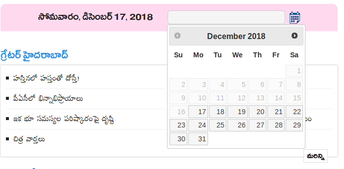
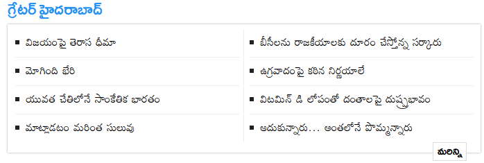

# eenadu-scraper

Example URL - https://www.eenadu.net/archivespage/districtnewsdetails/68463/529/n/2019-03-16

## TODO

Per [article](https://www.eenadu.net/archivespage/archivenewsdetails/77736/17-03-2019/home), save:
- all text
- video, if any
- image, if any

Steps
------
1. Pick a date. Note that archives are available only up to 3 months in history to the current date.

2. Get the [URL](https://www.eenadu.net/archivesdet/home/11-03-2019). [Example -- 11th March 2019](https://www.eenadu.net/archivesdet/home/11-03-2019). Click the bottom right button in every section

3. Get the [updated URL](https://www.eenadu.net/archivespage/more/11-03-2019) (has `/more/` appended). Save and fetch text from all URLs.
